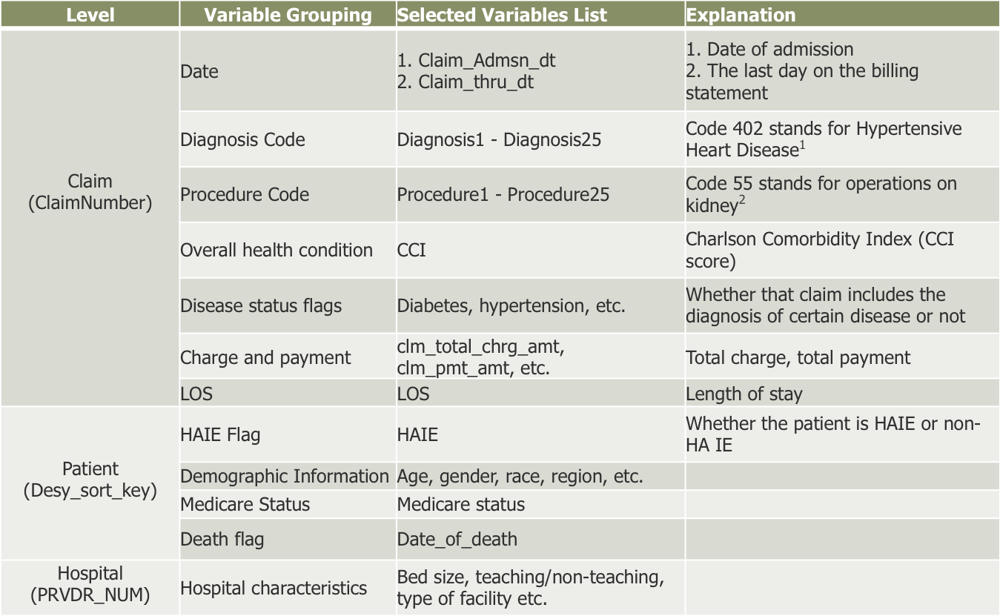

## Fanyi Zhang
## MPS in Applied Statistics
## 2015 Spring 

---

### Current data analysis problem:  
##### Examination of Hospital Acquired Infections of Endocarditis

Examine the Medicare claims data to understand the current HAI burden and
identify patient and hospital characteristics that are associated with them. The
results could provide insights into HAI prevention strategies and indicators of
hospital quality measure attainment.

##### Example of data



